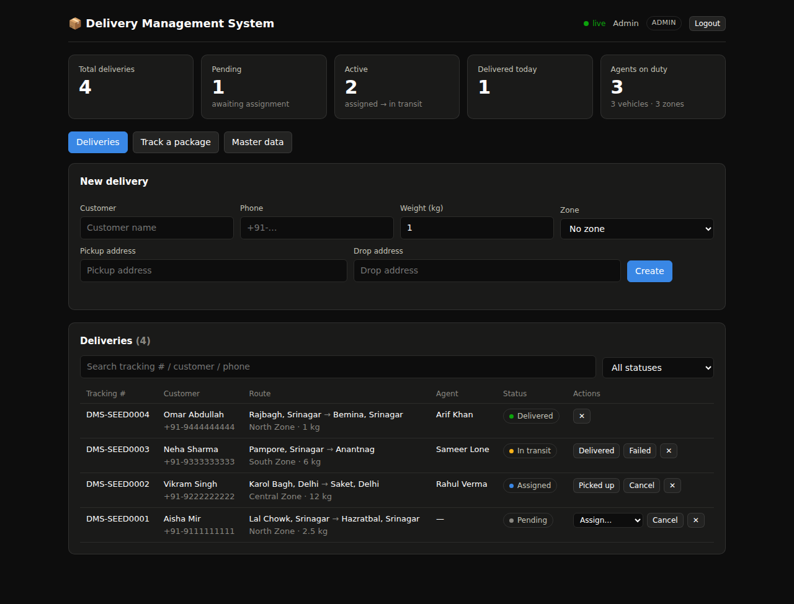

# Delivery-Management-System

This project implements a Delivery Management System with full CRUD. Admin manages master data. Users perform operations. JWT secures all routes and role middleware restricts admin-only operations. Delivery status changes are pushed to every connected dashboard in real time over Socket.IO.



## Features

- **JWT authentication** — register/login with bcrypt-hashed passwords; the first registered account becomes the admin
- **Role-based access control** — `authenticate` + `requireAdmin` middleware; admins manage master data and can delete records, users run day-to-day operations
- **Master data (admin)** — CRUD for delivery zones, vehicles (bike/van/truck) and delivery agents
- **Deliveries (users)** — create deliveries with auto-generated tracking numbers, assign agents, and move them through a validated status lifecycle:
  `pending → assigned → picked_up → in_transit → delivered` (with `failed` re-attempts and `cancelled`); illegal transitions are rejected with `409`
- **Audit trail** — every status change is recorded in `delivery_events` with actor and timestamp
- **Real-time dashboard** — Socket.IO pushes `delivery:created / updated / deleted` events to all logged-in clients; stat tiles and the deliveries table update without a reload
- **Public tracking** — `GET /api/track/:trackingNumber` needs no login and exposes only non-sensitive fields, like a real courier tracking page
- **Search, filtering & pagination** on the deliveries list
- **Security hardening** — helmet, CORS, rate-limited auth endpoints, parameterized SQL everywhere

## Tech Stack

Node.js · Express · SQLite (better-sqlite3) · Socket.IO · JSON Web Tokens · bcryptjs · vanilla HTML/CSS/JS dashboard

## Getting Started

```bash
npm install
npm run seed     # optional: demo data + demo accounts
npm start        # http://localhost:3000
```

Demo accounts created by the seed:

| Role  | Email           | Password |
|-------|-----------------|----------|
| Admin | admin@dms.local | admin123 |
| User  | user@dms.local  | user1234 |

Environment variables (all optional): `PORT` (default `3000`), `JWT_SECRET`, `JWT_EXPIRES_IN` (default `8h`), `DB_PATH`.

## API Overview

| Method | Route | Access | Description |
|--------|-------|--------|-------------|
| POST | `/api/auth/register` | public | Create account (first account = admin) |
| POST | `/api/auth/login` | public | Get a JWT |
| GET | `/api/auth/me` | any user | Current user |
| GET | `/api/master/zones` / `vehicles` / `agents` | any user | List master data |
| POST/PUT/DELETE | `/api/master/...` | **admin** | Manage master data |
| GET | `/api/deliveries` | any user | List (filter: `status`, `agent_id`, `zone_id`, `q`, `page`, `limit`) |
| POST | `/api/deliveries` | any user | Create delivery |
| GET | `/api/deliveries/:id` | any user | Delivery + event history |
| POST | `/api/deliveries/:id/assign` | any user | Assign an agent |
| POST | `/api/deliveries/:id/status` | any user | Advance the lifecycle |
| DELETE | `/api/deliveries/:id` | **admin** | Delete delivery |
| GET | `/api/track/:trackingNumber` | public | Track a package |
| GET | `/api/stats` | any user | Dashboard counters |

Socket.IO clients authenticate with `io({ auth: { token } })` and receive `delivery:created`, `delivery:updated` and `delivery:deleted` events.

## Tests

```bash
npm test
```

End-to-end smoke tests boot the real server against a throwaway database and cover auth, role enforcement, master data, the full delivery lifecycle (including illegal-transition rejection and the audit trail), public tracking, and the realtime socket event.

## Project Structure

```
server.js              Express app + HTTP server + Socket.IO bootstrap
src/db.js              SQLite connection and schema
src/middleware/        JWT auth, role guard, request validation
src/routes/            auth, master data, deliveries, tracking, stats
src/realtime.js        Socket.IO layer (JWT handshake, event broadcasting)
public/index.html      Single-page realtime dashboard
scripts/seed.js        Demo data
test/api.test.js       End-to-end smoke tests (node:test)
```
